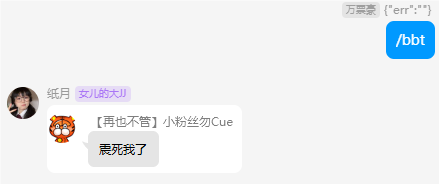

# koishi-plugin-imgbot

棒图bot

迁移自 [原mirai插件链接](https://github.com/shabby2333/imgbot) 

迁移迁移自 原cq插件( ~~RIP~~ )

## 使用方法
- koishi安装插件
- 在群内发送 /`{关键词}` `{图片进行存图操作}`
- 在群内发送 /`{关键词}` 随机返回关键词下的图

## 注意事项
- 目前该插件暂未使用koishi命令机制(存图时，命令解析有bug)
- 暂不支持自定义指令(~~懒得做~~)

# 从 `mirai-console` 版本插件迁移
- 将mirai实例中 `data/image/imgbot` 迁移到koishi目录 `data/assets/imgbot`
- 根据描述迁移设置项